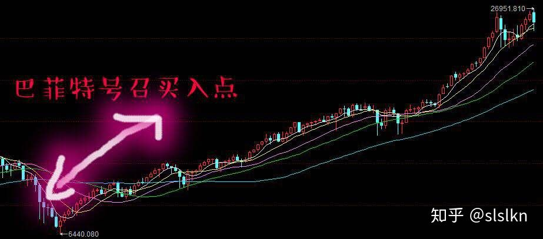

Buy American I Am — Warren E. Buffett
====

THE financial world is a mess, both in the United States and abroad. Its problems, moreover, have been leaking into the general economy, and the leaks are now turning into a gusher. In the near term, unemployment will rise, business activity will falter and headlines will continue to be scary.

美国和海外都一样，金融世界一团糟。更糟糕的是，金融领域的问题正在向总体经济扩散，并且这种扩散正在变成井喷。近期内，失业率将上升，商业行为将萎缩，媒体的头条新闻将持续引起恐慌。

So ... I’ve been buying American stocks. This is my personal account I’m talking about, in which I previously owned nothing but United States government bonds. (This description leaves aside my Berkshire Hathaway holdings, which are all committed to philanthropy.) If prices keep looking attractive, my non-Berkshire net worth will soon be 100 percent in United States equities.

因此，我已经并且正在买入美国股票。我所说的是指我的私人账户，这个账户里先前除了美国政府债券外什么也没有。（这里不考虑我所持的伯克希尔股票，那些都全部捐给了慈善事业。）如果股价持续保持吸引力，我的非伯克希尔资产不久就会100%的变成美联邦的股票。

Why?

为什么？

A simple rule dictates my buying: Be fearful when others are greedy, and be greedy when others are fearful. And most certainly, fear is now widespread, gripping even seasoned investors. To be sure, investors are right to be wary of highly leveraged entities or businesses in weak competitive positions. But fears regarding the long-term prosperity of the nation’s many sound companies make no sense. These businesses will indeed suffer earnings hiccups, as they always have. But most major companies will be setting new profit records 5, 10 and 20 years from now.

一个简单的原则指导着我的操作：当别人贪婪时要恐惧，当别人恐惧时要贪婪。非常确定，现在恐惧四处传播，甚至那些老练的投资者也被这种恐惧感所控制。当然，在弱势中对于高杠杆的实体或商业保持警惕是正确的，但对美国许多健康企业的长期繁荣表现出担心恐惧则是毫无道理的。与过去一样，这些企业确实会遭受短暂的盈利减少。但从现在起5、10、20年内，大多数公司都将继续新的盈利记录。

Let me be clear on one point: I can’t predict the short-term movements of the stock market. I haven’t the faintest idea as to whether stocks will be higher or lower a month — or a year — from now. What is likely, however, is that the market will move higher, perhaps substantially so, well before either sentiment or the economy turns up. So if you wait for the robins, spring will be over.

让我澄清一个观点：我无法预测证券市场的短期波动，对于未来一个月或是一年市场将上升还是下降我完全无法预见。然而，市场在市场情绪反转或者经济反转之前率先走高是完全可能的甚至是肯定的。因此如果你继续苦等知更鸟，春天却可能结束了。

A little history here: During the Depression, the Dow hit its low, 41, on July 8, 1932. Economic conditions, though, kept deteriorating until Franklin D. Roosevelt took office in March 1933. By that time, the market had already advanced 30 percent. Or think back to the early days of World War II, when things were going badly for the United States in Europe and the Pacific. The market hit bottom in April 1942, well before Allied fortunes turned. Again, in the early 1980s, the time to buy stocks was when inflation raged and the economy was in the tank. In short, bad news is an investor’s best friend. It lets you buy a slice of America’s future at a marked-down price.

这里是一段历史：大萧条年代，1932年7月8日，道琼斯指数见到最低点41点，虽然经济环境继续恶化直至1933年3月富兰克林.D.罗斯福总统就职。而此时市场已经回升了30%。或者我们回想二次大战的早期，当美国在欧洲和太平洋遭遇困境时，市场于1942年4月见到了底部，这远在联军的命运转折之前。再举例，1980年代早期，最好的买入时机是当通胀肆虐，经济陷入泥沼之时。简言之，坏消息是投资者最好的朋友。它让你可以以市场低价买入美国的未来。

Over the long term, the stock market news will be good. In the 20th century, the United States endured two world wars and other traumatic and expensive military conflicts; the Depression; a dozen or so recessions and financial panics; oil shocks; a flu epidemic; and the resignation of a disgraced president. Yet the Dow rose from 66 to 11,497.

长期来说，证券市场是好的。20世纪，美国经历了两次世界大战以及别的伤痕累累、代价高昂的军事冲突、大萧条、无数的经济不景气和金融恐慌、石油危机、流感时疫、总统辞职等。然而道琼斯指数从66点涨到了11497。

You might think it would have been impossible for an investor to lose money during a century marked by such an extraordinary gain. But some investors did. The hapless ones bought stocks only when they felt comfort in doing so and then proceeded to sell when the headlines made them queasy.

你也许会认为在这个持续一个世纪有着如此丰厚回报的市场里，投资者还会亏损是不可思议的，但是，许多的投资者确实如此。这些倒霉的投资人之所以如此倒霉，正是因为他们认为市场令他们舒服的时候买入而在市场让他们感觉不安时卖出。

Today people who hold cash equivalents feel comfortable. They shouldn’t. They have opted for a terrible long-term asset, one that pays virtually nothing and is certain to depreciate in value. Indeed, the policies that government will follow in its efforts to alleviate the current crisis will probably prove inflationary and therefore accelerate declines in the real value of cash accounts.

今天，持有现金的人们会感觉很舒适。可是不会是这样的。他们事实上选择了一种糟糕的长期资产，现金不会带来任何回报并且必定贬值。事实上，政府为了减轻目前的危机而努力实施的政策将很有可能是促进通货膨胀的，从而会进一步加速现金的贬值。

Equities will almost certainly outperform cash over the next decade, probably by a substantial degree. Those investors who cling now to cash are betting they can efficiently time their move away from it later. In waiting for the comfort of good news, they are ignoring Wayne Gretzky’s advice: “I skate to where the puck is going to be, not to where it has been.”

接下来的几十年，股票几乎肯定会比现金的回报高，很可能还高出不少。持有现金的投资者在赌他们能选择更好的时机。在痴等好消息的同时，这些投资人忽略了Wayne Gretzky的建议：“我滑冰时总是选择滑向那些恶作剧的精灵可能出现的区域，而不是他们已经存在的区域。”（巴菲特的意思是：持有现金是确定会出现坏情况的，而买入股票只是可能会出现坏情况。）

I don’t like to opine on the stock market, and again I emphasize that I have no idea what the market will do in the short term. Nevertheless, I’ll follow the lead of a restaurant that opened in an empty bank building and then advertised: “Put your mouth where your money was.” Today my money and my mouth both say equities.

我不喜欢对股票市场发表意见，我再一次强调我对于市场在短期内会如何波动一无所知。不过，我将遵从一家在空荡荡的银行大楼里开业的餐馆的广告指示：“把你嘴巴放到你的钱曾经呆过的地方。”今天我的钱和我的嘴巴都在说股票。

巴菲特发表此文后记：巴菲特号召买入后道琼斯工业指数走势具体如下所示

很显然， 市场并没有给股神面子，道琼斯工业指数在其号召买入后又跌了20%，有一段时间华尔街常常拿巴菲特上面的文章嘲笑他“廉颇老矣”。但巴菲特每天照样7点开着50年代的凯迪拉克，买2.96元的汉堡早餐，读一天的财报，回家洗洗睡觉。一直到5个月后的2009年3月，美国股市真正到了底点并开始反弹。在此之后，美国股市经历了历史上最长的牛市，从2008年10月16日到10年后的现在，道琼斯工业指数最多涨了230%。

今天的我们该如何应对：巴菲特这篇经典的文章，生动的说明在别人恐惧时自己是如何贪婪的，同时也生动的指出了巴菲特在市场恐慌时他是如何做出决定主动买套的。因此这篇文章值得我们反复的学习和推敲。当然主动买套都是大资金所为，这几天市场虽然屡创新低，但一些优质股票涨停数却很多的原因，就是因为有很多长线大资金开始建仓了。不过对于我们普通投资者而言，我还是建议右侧交易，等主要指数站上60日线后再动手吧。