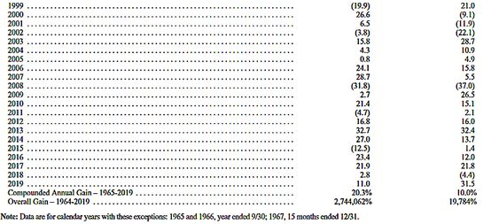

巴菲特发布2020年致股东公开信（全文）
=====

**北京时间2月22日晚，股神巴菲特在伯克希尔·哈撒韦公司官网公布每年一度的致股东公开信。**

巴菲特这封2020年致股东公开信，主要讨论的是伯克希尔2019年的得失。

**财报显示，伯克希尔·哈撒韦公司2019年第四季度经营利润为44.2亿美元，同比下降23%，去年同期为57.2亿美元；归属伯克希尔哈撒韦股东的净利润为291.59亿美元，相比之下上年同期为净亏损253.92亿美元。**

**2019年第四季度，伯克希尔·哈撒韦A类股（BRK.A）每股收益17909美元，上年同期每股亏损15467美元**；B类股（BRK.B）每股收益11.94美元，上年同期每股亏损10.31美元。

截至2019年12月31日，伯克希尔·哈撒韦的A类流通股总数为1628138股，B类流通股总数为2442207505股。

**从2019年全年来看，归属伯克希尔·哈撒韦股东的净利润814.17亿美元，相比之下上年同期净利润为40.21亿美元。**

其中，投资收益为562.72亿美元，相比之下上年同期投资亏损为175.00亿美元；衍生品收益为11.73亿美元，相比之下上年同期衍生品亏损为2.37亿美元；无形资产减损为零，上年同期为30.23亿美元；运营利润239.72亿美元，相比之下上年同期为247.81亿美元；A类普通股每股收益49828美元，上年同期每股收益2446美元；B类普通股每股收益33.22美元，上年同期每股收益1.63美元。

**截至2019年底，公司持有股票总市值2480.27亿美元，相比2018年末的持仓市值1727.57亿美元，增加752.7亿美元，增幅为43.57%。**2019年标普500指数增幅为28.88%。巴菲特股票持仓跑赢大市14.69个百分点。伯克希尔哈撒韦第一大持仓苹果公司2019年股价增长88.96%，贡献巨大。但伯克希尔哈撒韦（A类）股价去年涨幅仅为11%，逊于大盘。

**伯克希尔·哈撒韦表示，由于2018年公认会计原则（GAAP）的变化，需要将股票证券投资的未实现收益/损失的变化作为投资收益/损失的一个组成部分计入收益报表。**因此，2019年投资收益/亏损包括第四季度约236亿美元的收益和全年约537亿美元的收益，2018年包括第四季度约281亿美元的亏损和全年约206亿美元的亏损，这些亏损是由于第四季度的变化和我们的股票证券投资控股存在的未实现收益造成的。投资收益/损失还包括2019年第四季度和2018年第四季度投资销售的税后实现收益，分别约为10亿美元和8亿美元，以及2019年全年约为26亿美元和2018年全年约为31亿美元。

**依照惯例，伯克希尔的业绩与美股风向标：标普500指数表现的对比**，2019年伯克希尔每股市值的增幅是11.0%，而标普500指数的增幅高达31.5%，伯克希尔跑输了20.5个百分点。但长期来看，1965-2019年，伯克希尔每股市值的复合年增长率为20.3%，明显超过标普500指数的10.0%，而1964-2019年伯克希尔的市值增长率是令人吃惊的2744062%，也就是27440倍多，而标普500指数为19784%，即接近200倍。

**巴菲特致股东信首页对比伯克希尔的业绩与美股标杆：标普500指数的表现**

### **巴菲特股东信十大看点：**

**看点一、巴菲特旗下公司股票持仓市值2480亿美元，浮盈125%**

据巴菲特旗下伯克夏尔哈撒韦公布的最新年度报告，截至2019年底，公司持有股票总市值2480.27亿美元，盈利125%。公司前五大持仓中，绝对收益都超过100亿美元，而且收益比例也均超过100%。其中第三、第四大持仓可口可乐和美国运通的盈利分别高达16倍和13.7倍。苹果作为第一大持仓，账目浮盈达到383.8亿美元，收益109%。

**看点二、巴菲特谈50亿回购：希望公司股票数量下降 但不会在任何水平支撑股价**

巴菲特在股东信中表示，随着时间的推移，希望伯克希尔的股票数量下降。如果股价价值折扣扩大，我们可能会更加积极地购买股票。不过，我们不会在任何价位支撑股价。在2019年，伯克希尔的价格/价值等式有时是适度有利的，我们花了50亿美元回购了公司大约1%的股份。

**看点三、巴菲特：不喜欢玩预测利率的游戏 未来股价可能发生任何变化**

巴菲特在股东信中表示，我从来不喜欢玩预测利率的游戏，因为我们不知道未来一年、十年或三十年里利率的平均值是多少。我们或许有些偏见地认为，在这个话题上发表意见的权威人士，恰恰是通过这种行为，透露出的更多的是和他们自己有关的信息，而不是关于未来的信息。巴菲特在股东信中表示，未来股价可能发生任何变化。偶尔，市场会出现暴跌，幅度可能达到50%甚至更大。

**看点四、巴菲特：低利率有利股市**

巴菲特在股东信中表示，芒格和我无法预测未来利率走势，但如果在未来几十年内都接近于当前的利率，并且公司税率也保持在现有低位附近的话，那么几乎可以肯定的是，随着时间推移，股票的表现将远好于长期的固定利率债务工具。

**看点五、巴菲特：收购就好比婚姻**

巴菲特在股东信中表示，多年来，伯克希尔收购了许多公司，最初我全部将它们视为“好生意”。” 但是，最后有些公司却令人失望，有不少简直是彻底的灾难。另一方面，有不少公司却超出了我的期望。

回顾我时好时坏的投资记录时，我得出的结论是，收购就好比婚姻：当然，一开始婚姻是令人开心的，但随后，现实开始偏离婚前的期望。美妙的是，有些时候，新婚夫妇为双方带来了超出预期的幸福。而在另外一些情况下，幻灭也来得很快。将这些画面放到公司收购上面，我不得不说，一般是收购者遇到不愉快的突发状况。在追求收购的阶段，我们总是容易满眼乐观。

**看点六、巴菲特：伯克希尔进行符合要求的大型收购的机会很少**

巴菲特在股东信中表示，伯克希尔哈撒韦公司进行符合要求的大型收购的机会很少。

**看点七、巴菲特：不断寻求收购符合三个标准的新企业**

巴菲特在股东信中表示，我们不断寻求收购符合三个标准的新企业。首先，它们的净有形资本必须取得良好回报。其次，它们必须由能干而诚实的管理者管理。最后，它们必须以合理的价格买到。

**看点八、巴菲特眼中的风险：决策依赖少数关键人物 投资太集中于股票**

信中披露了伯克希尔哈撒韦公司目前面临的几大风险：公司投资决策和资本配置依赖少数关键人物；需要合格人员管理和经营各种业务；投资异常集中于股票，公允价值波动大；竞争和科技可能会侵蚀公司特许经营业务，并导致收入下滑；一般经济状况的恶化可能会大大降低公司的经营收益，并损害公司以合理成本进入资本市场的能力；恐怖行为可能会损害公司经营业务；监管变化可能会对公司未来的经营结果产生不利影响；网络安全风险。

**看点九、巴菲特：我和我的继承人都不会抛售伯克希尔股票**

巴菲特在股东信中表示，我和芒格想要确保伯克希尔在我们退休后保持繁荣发展。芒格持有的伯克希尔股份超过其家族的其他任何投资，而我的全部净资产中有99%以伯克希尔股票形式存在。我从未出售过任何伯克希尔持股股票，也没有计划这样做。我的遗嘱目前明确指示其执行人以及管理我的财产的受托人——不得出售伯克希尔股份。

**看点十、巴菲特股东大会5月2日举行 股神接班人呼之欲出？**

巴菲特在股东信中确认，2020年度巴菲特股东大会将于5月2日举行，两名副手Ajit Jain和Greg Abel将在会上有更多的曝光机会。巴菲特在股东信中称，“我们将于2020年5月2日举行年会。和往常一样，雅虎将在全球直播此次活动。然而，我们的形式将有一个重要的变化：两位关键投资经理Ajit Jain和Greg Abel将在会上有更多的曝光机会。这种改变很有意义。他们是杰出的人才，无论是作为管理者还是作为个人。”

**巴菲特2020年致股东公开信全译：**

致伯克希尔哈撒韦股东：

根据美国通用会计准则（GAAP），伯克希尔2019年盈利814亿美元，其中包括：运营利润为240亿美元，37亿美元的已实现资本收益，537亿美元是从我们持有股票的未实现资本收益净额的增加中获得的收益。上述收益的每一部分都是在税后基础上列出的。

这537亿美元的收益需要说一说。这是由于2018年实施的新GAAP规则，要求持有股票证券的公司在收益中包括这些证券未实现损益的净变化。正如我们在去年的信中所说的那样，无论是我管理伯克希尔的合作伙伴查理·芒格（Charlie Munger），还是我本人都不认同这一规则。

事实上，会计行业采用这一规则是其自身思想的巨大转变。在2018年之前，GAAP坚持 —— 业务是证券交易的公司除外 —— 股票组合中的未实现损益永远不包括在收益中，只有在被认为“非临时”的情况下才计入未实现损失。现在，伯克希尔哈撒韦(0.39%)必须在每个季度的利润 —— 对许多投资者、分析师和评论员来说，这是一个关键项目 —— 计入其所拥有的股票的每一次上下波动，无论这些波动多么反复无常。

伯克希尔的2018年和2019年财报清楚地说明了我们对新规则的争议。在股市下跌的2018年，我们的未实现净收益减少了206亿美元，因此我们报告的GAAP收益仅为40亿美元。而2019年，由于股票价格上涨，未实现净收益增加了上述的537亿美元，推动GAAP收益达到本信开头所报告的814亿美元。这些市场波动导致GAAP收益疯狂增长了1900%！

与此同时，在我们所称的现实世界中，与会计领域不同的是，伯克希尔的股票持有量在这两年中平均约为2000亿美元，我们所持有股票的内在价值在整个期间稳步大幅增长。

查理和我敦促你们专注于运营利润 —— 2019年几乎没有变化 —— 并忽略季度和年度投资收益或损失，不管这些收益是实现的还是未实现的。

我们的建议丝毫不会降低这些投资对伯克希尔的重要性。随着时间的推移，查理和我预计我们的持股 —— 作为一个整体—— 将带来重大收益，尽管方式不可预测并且非常不规则。要了解我们为什么乐观，请进入下一个讨论。

### **留存收益的力量**

1924年，名不见经传的经济学家兼财务顾问埃德加·劳伦斯·史密斯写了《普通股票作为长期投资》（Common Stocks as Long Term Investments）一书，这是一本薄薄的书，却改变了投资世界。的确，写这本书改变了史密斯本人，迫使他重新评估自己的投资信念。

他打算在书中指出，在通胀时期，股票的表现会好于债券，而在通缩时期，债券的回报会更高。这似乎已经足够明智了。但史密斯让人大吃一惊。

他的书以一段自白开始：“这些研究是失败的记录 —— 失败的事实无法支持一个先入之见的理论。”对投资者来说，幸运的是，这一失败促使史密斯更深入地思考应该如何评估股票。

关于史密斯的真知灼见，我要引用一位早期的评论家的话，他就是约翰-梅纳德-凯恩斯，“我把史密斯先生最重要的，当然也是他最新颖的观点保留到最后。通常，管理良好的工业公司不会将其全部盈利分配给股东。在好年景里，即使不是所有年景，他们也会保留一部分利润，重新投入到业务中去。因此，好的投资存在一个有利的复利因素。经过多年的时间，除了支付给股东的股息外，一家稳健的工业企业资产的实际价值会以复利形式上不断增长。”

在圣水的洒落下，史密斯的真知灼见变得浅显易懂。

很难理解为什么在史密斯的书出版之前，留存收益没有得到投资者的重视。毕竟，早前像卡内基、洛克菲勒和福特这样的巨头积累了令人难以置信的财富，这已经不是什么秘密了，他们都保留了大量的商业利润来支持增长和创造更大的利润。同样，在整个美国，长期以来也有一些小资本家遵循同样的方法致富。

然而，当企业所有权被分割成非常小的碎片——“股票”，前史密斯时代的买家通常认为他们的股票是对市场波动的短期赌博。即使往好里说，股票也被认为是投机。而绅士更喜欢债券。

尽管投资者很晚才明白这个道理，但保留利润和再投资的数学原理现在已经很清楚了。今天，学校里的孩子们也能理解凯恩斯所谓的“新奇言论”：即储蓄与复利的结合创造了奇迹。

在伯克希尔，芒格和我长期以来一直专注于有效地利用留存收益。有时这项工作很容易，有时却很困难，特别是当我们开始与数额巨大且不断增长的资金打交道时。

在配置我们留存的资金时，我们首先寻求投资于我们已有的多种不同业务。在过去10年里，伯克希尔的折旧费用总计为650亿美元，而公司在房地产、厂房和设备方面的内部投资总计达到1210亿美元。对生产性资产的再投资将永远是我们的首要任务。

此外，我们不断寻求收购符合三个标准的新企业。首先，它们的净有形资本必须取得良好回报。其次，它们必须由能干而诚实的管理者管理。最后，它们必须以合理的价格买到。

当我们发现符合标准的企业时，我们的首选是购买100%股份。但是，符合我们标准的大型收购机会少得可怜。更常见的情况是，变化无常的股市为我们提供了机会，让我们可以买进符合我们标准的上市公司的大量但非控股股份。

无论我们采取何种方式，控股公司还是仅通过股票市场持有大量股份，伯克希尔的财务业绩将在很大程度上取决于我们所收购企业的未来收益。尽管如此，这两种投资方式之间存在着一个非常重要的会计差异，这是你必须了解的。

在我们的控股公司（定义为伯克希尔拥有50%以上股份的公司）中，每项业务的收益直接流入我们向你报告的运营利润。你所看到的即是你所得到的。

在我们拥有有价股票的非控股公司中，只有伯克希尔获得的股息记录在我们报告的营业中。留存收益？它们正在努力创造更多的附加值，但我们并不将其直接计入伯克希尔公司的报告收益中。

在除伯克希尔以外的几乎所有主要公司中，投资者都不会发现我们称之为“无法认列盈利”的重要性。但是，对我们而言，这是一个突出的遗漏，我们在下面为你介绍其规模。

在这里，我们列出我们在股票市场上持股比重最大的10家企业。根据美国通用会计准则（GAAP），该表格向你分别报告了收益 —— 这些是伯克希尔从这10个投资对象获得的股息，以及我们在投资对象保留并投入运营的利润中所占的份额。通常，这些公司使用留存收益来扩展业务并提高效率。有时候，他们用这些资金回购自己的股票中的很大一部分，此举扩大了伯克希尔公司在其未来收益中的份额。

**伯克希尔公司的股份（单位为百万）**

公司 | 年底持股比例 | 股息（1）| 留存收益（2）|
| --- | :--- | :---: | ---: |
| 美国运通 | 18.7% | $261 | $998 |
| 苹果公司 | 5.7%  | 773  | 2519 | 
|美国银行  |10.7%  |682   | 2167 |
|纽约梅隆银行| 9.0% |101   | 288  |
|可口可乐  | 9.3%  | 640  | 194  |
|达美航空  | 11.0% | 114  | 416  | 
|摩根大通  | 1.9%  | 216  | 476  |
|穆迪     | 13.1% | 55   | 137  |
|美国合众银行|9.7% | 251  | 407  |
|富国银行   | 8.4% | 705  | 730 |
| 总计 | $3798 | $8332 |

（1） 基于当前年率。
（2） 基于2019年利润减去已支付的普通股和优先股股息。

显然，我们从这些部分持股的每家公司中最终记录的已实现收益，并不完全对应于“我们”在其留存收益中的份额。有时留存收益没有任何效果。但是逻辑和我们过去的经验都表明，从其整体中，我们获得的资本收益至少能等于、还可能超过我们在其留存收益中的份额。（当我们出售股票并实现收益时，我们将按照当时的税率缴纳所得税。目前，联邦税率为21%。）

可以肯定的是，伯克希尔从这10家公司以及我们许多其他持股公司中获得的回报，将以非常不规律的方式表现出来。定期会有损失，有时是特定公司的损失，有时损失与股市低迷有关。在其他时候（去年就是其中之一），我们的收益将会大大增加。总体而言，我们投资对象的留存收益必将对伯克希尔公司的价值增长起到重要作用。

史密斯先生说的没错。

### **非保险业务**

汤姆•墨菲（Tom Murphy）是伯克希尔哈撒韦公司（Berkshire）颇有价值的董事，他是一名具有优秀才能的企业经理人。在很久以前，他就给了我一些关于收购的重要建议：“要获得良好管理者的声誉，只需确保您收购好企业即可。”

多年来，伯克希尔已经收购了几十家公司，我最初认为所有这些公司都是“好公司”。然而，有些结果令人失望；有不少是彻头彻尾的灾难。另一方面，一个合理的数字超出了我的期望。

回顾我不平坦的记录，我得出结论，收购与婚姻类似：当然，它们以一个快乐的婚礼开始 —— 但随后，现实往往与婚前的预期不同。有时，这个新联盟所带来的幸福是任何一方都无法想象的。但是，在其他情况下，幻灭也是迅速的。把这些形象应用到企业收购上，我不得不说，通常是买家遭遇了令人不快的意外。在公司的“求爱”过程中，很容易眼神恍惚。

按照这个类比，我想说，我们的婚姻记录在很大程度上是可以接受的，所有人都对他们很久以前做出的决定感到满意。我们的一些合作确实是田园诗般的。然而，一个有意义的数字让我很快就想知道我“求婚”的时候在想什么。

幸运的是，我犯的许多错误带来的影响已经被大多数令人失望的企业所共有的一个特征所减轻了：即随着时间的流逝，“糟糕”的企业往往进入了一个停滞不前的状态，在这样的状态中，伯克希尔所运营需要的资本比例越来越小。

与此同时，我们的“好”企业往往倾向于发展及并找到以诱人的速度投资更多资本的机会。由于这些截然不同的发展轨迹，伯克希尔的赢家所使用的资产逐渐成为我们总资本中不断扩大的一部分。

作为这些金融活动的一个极端例子，看看伯克希尔最初的纺织业务吧。当我们在1965年初获得公司的控制权时，这个陷入困境的公司几乎需要伯克希尔所有的资本。因此，在一段时间内，伯克希尔不赚钱的纺织资产对我们的整体回报造成了巨大拖累。但最终，我们收购了一批“好”企业，到上世纪80年代初，这一转变导致纺织业规模不断缩小，我们的资本只有一小部分被占用。

如今，我们把你们的大部分资金投入到受我们控制的业务中，这些业务为企业的运营所需的净有形资产实现了从优秀到卓越的回报。我们的保险业务一直是超级明星。这种操作具有特殊的特点，使它成为衡量成功与否的独特标准，这是许多投资者所不熟悉的。我们将在下一节中讨论这个问题。

在接下来的几段中，我们将各种各样的非保险业务按照盈利规模、扣除利息、折旧、税收、非现金薪酬、重组费用等因素后的收益进行了分类 —— 所有这些项目非常恼人但确实是非常真实的成本，而且首席执行官们和华尔街人士有时敦促投资者忽略它们。有关这些操作的更多信息可在K-6 - K-21页和K-40 - K-52页找到。

我们的BNSF铁路公司和伯克希尔哈撒韦能源公司（BHE）是伯克希尔哈撒韦公司非保险集团的两只领头羊。它们在2019年的总收益达到83亿美元（仅包括我们在BHE 91%股份所占的份额），比2018年增长了6%。

接下来按盈利排名的五家非保险子公司（但以下的名字按首字母顺序排列）是：克莱顿房屋公司（Clayton Homes）、国际金属加工公司（International Metalworking）、路博润公司（Lubrizol）、马蒙公司（Marmon）和精密铸件公司（Precision Castparts）。它们在2019年的总盈利为48亿美元，与2018年的收益相比变化不大。

紧随其后的五家公司（伯克希尔·哈撒韦汽车公司、约翰斯·曼维尔公司、NetJets公司、Shaw公司和TTI公司）去年的收益为19亿美元，高于2018年的17亿美元。

伯克希尔持有的剩下的其他非保险业务——数量很多——2019年的总盈利为27亿美元，低于2018年的28亿美元。

2019年，我们控制的非保险业务的总净盈利为177亿美元，比2018年的172亿美元增长3%。收购和处置对上述结果几乎没有产生任何净效应。

我必须补充最后一条，它强调了伯克希尔的业务范围之广。自2011年以来，我们已经拥有了路博润（Lubrizol）公司，这是一家总部设在俄亥俄州的公司，在世界各地生产和销售石油添加剂。2019年9月26日，一场源自隔壁一家小工厂的火灾蔓延至路博润位于法国的一家大型工厂。

结果造成了重大的财产损失和路博润业务的严重中断。即便如此，路博润公司的财产损失和业务中断损失都将通过大量的保险赔偿来减轻。

但是，正如已故的保罗•哈维（Paul Harvey）在他著名的广播节目中所说的那样，“接下来的故事是这样的。”路博润最大的保险公司之一是…嗯，伯克希尔哈撒韦公司。

在马太福音6章3节，圣经教导我们“不要让左手知道右手在做什么”。你们的主席显然是按照命令行事的。

### **财产与意外险保险（P/C）**

1967年，我们以860万美元收购了国民保险公司（National Indemnity）及其姊妹公司National Fire & Marine。自那以来，我们的财产/意外险业务一直是推动伯克希尔哈撒韦公司增长的引擎。

如今，按净值计算，国民保险公司是全球最大的财产与意外险保险公司。保险是一个充满承诺的行业，伯克希尔履行承诺的能力是无与伦比的。

我们被P/C业务吸引的一个原因是这个行业的商业模式：P/C保险公司预先收取保费，然后支付索赔。在极端的情况下，如因接触石棉或严重的工作场所事故而引起的索赔，支付时间可能长达数十年。

这种先收后付的模式让P/C公司持有大量资金——我们称之为“浮存金”——这些资金最终将流入其它公司。与此同时，保险公司可以为了自己的利益而利用这些浮存金。虽然个体保单和索赔来来往往不会中断，但保险公司持有的浮存金通常相对于保费金额保持相当稳定。因此，随着我们的业务增长，我们的浮动资金也在增长。至于它是如何增长的，如下表所示：

我们最终可能会经历浮存金的下降。如果是这样，下降将是非常缓慢的——在外部的至少在任何一年里不超过3%。我们保险合同的性质是这样的，即我们永远不能受制于即刻的或近在的对我们现金资源具有重大影响金额的约束。这种结构是经过设计的，是我们保险公司无与伦比的财务实力的关键组成部分。这种力量永远不会被削弱。

如果我们的保险费超过了我们的支出和最终损失的总和，我们的保险业务就会产生承保利润，从而增加浮存金产生的投资收益。当获得这样的利润时，我们享受免费资金的使用——而且，更好的是，因为持有它而获得报酬。

对于整个P/C行业来说，浮存金的财务价值现在远远低于多年来的水平。这是因为几乎所有P/C公司的标准投资策略都严重——并且适当地——偏向于高等级债券。因此，利率的变化对这些公司来说至关重要，在过去十年中，债券市场提供了极低的利率。

因此，保险公司每年都被迫——由于到期或发行人赎回条款——将其“旧”投资组合回收到提供低得多收益的新资产中。这些保险公司曾经可以在每一美元的浮存金上安全赚到5美分或6美分，而现在只能赚到2美分或3美分（如果它们的业务集中在从未有过的负利率境地的国家，赚得就更少了）。

一些保险公司可能试图通过购买低质量债券或有望获得更高收益的非流动性“替代”投资来减轻收入损失。但这些都是危险的游戏和活动，大多数机构都没有能力去玩。

伯克希尔的情况比一般保险公司更有利。最重要的是，我们无与伦比的资本、充足的现金和巨大而多样化的非保险收益使我们能够拥有比行业内其他公司普遍拥有的更大的投资灵活性。对我们开放的许多选择总是有利的——有时也给我们带来了重大机会。

与此同时，我们的P/C公司有着出色的承保记录。伯克希尔哈撒韦过去17年中的16年实现了承保利润，唯一例外是2017年，当时我们税前亏损高达32亿美元。在整个17年时间里，我们的税前收益总计275亿美元，其中4亿美元是在2019年录得的。

这一记录并非偶然：有纪律的风险评估是我们保险经理日常关注的焦点，他们知道浮存金的回报可能会被糟糕的承保结果所淹没。所有保险公司都在口头上做出承诺。而在伯克希尔，它是一种宗教，旧约风格的宗教。

正如我过去一再做的那样，我现在要强调的是，保险业的幸福结果远非一件确定的事情：我们肯定无法做到在未来17年中的16年也实现承保利润。危险总是潜伏着的。

评估保险风险的错误可能是巨大的，可能需要很多年——甚至几十年——才能浮出水面和成熟。（想想石棉。）一场让“卡特里娜”和“迈克尔”飓风相形见绌的大灾难将会发生——也许是明天，也许是几十年后。“大灾难”可能来自传统来源，如风灾或地震，或者它可能是一个完全令人惊讶的事情，比如，一次网络攻击，其后果是灾难性的，超出了保险公司目前所考虑的范围。当这样一场巨型灾难发生时，伯克希尔将承受它的损失份额，它们将是巨大的-非常大的。然而，与许多其他保险公司不同的是，处理损失不会使我们资源紧张，我们将渴望在第二天增加我们的业务。

闭上你的眼睛，试着设想一个地方，可能会产生一个充满活力的P/C保险公司。纽约？伦敦？硅谷？

### **威尔克斯-巴里（Wilkes-Barre）怎么样？**

2012年末，我们的保险业务经理阿吉特-杰恩（Ajit Jain）打电话告诉我，他将以2.21亿美元（当时公司的净值）的价格，收购宾夕法尼亚州一个小城的一家小公司——GUARD保险集团。他还说，GUARD的首席执行官福格尔（Sy Foguel）将成为伯克希尔的明星。GUARD和Sy对我来说都是新名字。

棒极了：2019年，GUARD的保费收入为19亿美元，较2012年增长了379%，承保利润也令人满意。自从加入伯克希尔以来，福格尔带领公司进入了新产品和新地区，并将GUARD公司的浮存金增加了265%。

在1967年，奥马哈似乎不太可能成为一个P/C巨头的跳板。威尔克斯-巴利很可能会带来类似的惊喜。

### **伯克希尔哈撒韦能源**

伯克希尔哈撒韦能源公司正在庆祝其在我们旗下的第20个年头。这个周年纪念日表明我们应该赶上公司的成就。

我们现在要谈谈电价。当伯克希尔在2000年进入公用事业领域时，收购了BHE的76%股份，公司对爱荷华州的居民客户收取的电价是平均每千瓦时8.8美分。自那以来，居民客户的电价每年上涨不到1%，我们承诺，到2028年，基础电价不会上涨。相比之下，爱荷华州另一家大型公用事业公司的情况是这样的：去年，该公司对居民用户的收费比BHE高出61%。最近，这家公用事业公司的电价再次上涨，将与我们的电价差距扩大到70%。

我们与他们之间的巨大差异很大程度上是由于我们在将风能转化为电能方面取得的巨大成就。到2021年，我们预计BHE在爱荷华州将通过其拥有和运营的风力涡轮机产生约2520万兆瓦时（MWh）的电力。这些电力将完全满足其爱荷华州客户的年度需求：约2460万兆瓦时。换句话说，我们的公用事业将在爱荷华州实现风能自给自足。

与此形成鲜明对比的是，爱荷华州的另一家公用事业公司，风力发电不足总发电量的10%。此外，据我们所知，到2021年，无论在哪里，没有其他投资者拥有的公用事业公司能实现风能自给自足。在2000年，BHE当时主要服务于一个农业经济体；如今，它的五大客户中有三个是高科技巨头。我相信他们在爱荷华州建厂的决定部分是基于BHE提供可再生、低成本能源的能力。

当然，风是断断续续的，我们在爱荷华州的风力发电机只在部分时间里转动。在某些时段，当空气静止时，我们依靠其它发电设施来保证客户所需的电力。在风力发电机工作的时候，我们把风能提供给我们的多余电力卖给其他公用事业公司，通过所谓的“电网”为他们服务。“我们卖给他们的电力取代了他们对碳资源的需求，比如煤炭或天然气。

伯克希尔哈撒韦公司目前与小沃尔特-斯科特（Walter Scott， Jr．）和格雷格-阿贝尔（Greg Abel）共同持有BHE 91%的股份。自从我们收购BHE公司以来，BHE从未支付过股息，而且随着时间流逝，BHE已经拥有了280亿美元的收益。这种模式在公用事业领域是个例外，公用事业公司通常会支付高额股息，有时甚至超过80%的利润。我们的观点是：我们投资的越多，我们就越喜欢它。

如今，BHE拥有的运营人才和经验可以用来管理真正的大型公用事业项目，这些项目需要1000亿美元或更多的投资，可以支持有利于我们国家、我们的社区和我们的股东的基础设施。我们随时准备、愿意和有能力接受这样的机会。