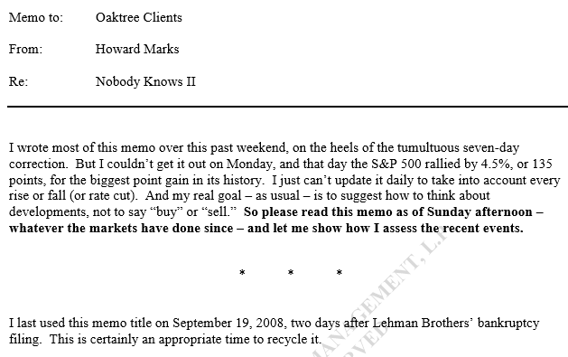

霍华德·马克斯最新备忘录：关于疫情和投资
=====

全球顶级投资人、橡树资本创始人霍华德·马克斯近日发给客户的公开信中谈及关于冠状病毒的观点以及其对市场的影响。

他认为：

* 目前对于新型冠状病毒还有很多未知的东西，病毒对于市场的影响是：坏消息+心理下跌→价格下跌；
* 当病毒对经济的影响减弱，但我们只剩下100个基点或不到用来对抗任何出现的衰退，美联储能做什么？美联储/政府的影响有限；
* 冠状病毒不太可能从基本上永久改变我们已知的生活；
* 买，卖或者持有？我认为买一些是没问题的，因为东西变得更便宜了。但没有合理的理由花光你所有的现金，因为我们并不知道未来事件会变得多负面。

致：橡树资本客户

来自：霍华德∙马克斯

关于：没有人知道2（Nobody Knows Ⅱ）

**** 
这篇备忘录的大部分写于上个周末，紧随着股市七天剧烈的修正。但是我周一的时候还没写完，而当天标普500止跌回升了4.5%，或者说135点，是其历史上的最大的点数上涨。我不能对备忘录做每天的更新，将每天的上涨或下跌考虑进去（包括降息）。而我真正的目的——和往常一样——是启发如何对事情变化进行思考，并非告诉你「买」或「卖」。**所以请当做你在周日的下午阅读这篇备忘录——无论此后的市场已经发生了什么——让我展示我如何评估最近的事件。**

我上一次使用这个备忘录的标题是在2008年9月19日，在雷曼兄弟破产申请的两天后。无疑这是重新使用这个备忘录的合适的时机。

在过去几周，我被反复问及我的关于冠状病毒的观点以及其对市场的影响。我已经有了一个现成的答案，多亏了我一月份的备忘录You Bet！的一些内容。正如你可能记得，我从Annie Duke的关于做决策的书《关于博弈的思考》（Thinking in Bets）大量引用。对我影响最深的——并且我在1月13日发布备忘录后大量使用的——是这段话：

在任何领域，一个专家相比新手会有优势。但无论是老兵还是新手都无法确认下一次是什么样子。*只不过老兵会猜得更好。
*
**换句话说，如果我对冠状病毒做任何评论，那也仅仅是猜测。**

我在过去写过当中国人问我关于他们国家未来的观点时我的反应。「你住在那里，」我说。「我没有。你为什么问我呢？」不仅仅因为我不是中国专家，我也坚定相信一个国家的未来无法预测，特别是一个在独一无二的体系下运行的国家。我提供了关于中国未来的观点，但我赶紧指出这仅仅是一种直觉。**人们可能询问我的观点，因为他们认为我是智慧的，认为我已经是一个成功的投资者，或者知道我已经经历过大量的历史事件。但那些都不应该混同为我是每一种话题的专家。**

让我回到冠状病毒的话题上。没有人知道许多的信息，因为这是其第一次出现。正如哈佛流行病学家Mark Lipsitch在播客上关于这个话题所说的：存在（a）事实,（b）从其他病毒的类比得到的有根据的推断，和（c）观点或者推测。**科学家试着做出有根据的推断。目前为止，关于冠状病毒，我不认为有足够的数据让他们可以把这些推断确认为事实。因此一个非科学家所说的任何观点很可能只是猜测。**

因此，总的来说，存在事实、推断和猜测。知道你在处理的是什么信息是很关键的。关于病毒，我不认为有谁知道以下问题的答案：

* **病毒如何在人与人以及社区与社区间传播？**——存在检测阳性，但未知与其他阳性感染者或曾经在疫情爆发国家待过的人群接触。

* **有多少人会受感染？** ——在2月28日，世卫组织总干事说WHO已经「把COVID-19传播风险的评估和影响风险在全球的范围内提升到非常高」。根据Lipsitch博士的观点，病毒会影响到所有成年美国人当中的40%-70%。（我提供这个信息仅作为例子。我并不是说这个说法是正确的，或者他的观点是我们应该接受的。）

* ****疫情会减弱吗？** ——根据报告的数据，在中国的新案例数已经大幅下降，从二月份上半个月的13天当中有9天每日新增超3000人，到该月底的9天里有8天每日新增少于500人。这个结果有多大是因为限制人们自由行动的作用？在多大程度上这个下降趋势可以外推到世界其他地方？有些人说病毒会在天气转暖后减弱，正如其他流感一样。这可以运用到这个情况吗？

* **疫情会产生什么影响？**——迄今为止，感染病毒的人仅有20%经验到比「轻微」更严重的情况，并且受感染的人的死亡率目前仅为2-3%。这个比例会维持住吗？死亡人群会不会继续主要发生在年长或缺乏抵抗力的人群？Lipsitch博士讲的40-70%人群的2%意味着在美国一百万人的死亡。另一方面，根据Dean Jamison，一个全球健康经济学家以及加州大学旧金山分校的名誉教授所说：

……美国拥有比中国更优秀的医疗体系，在中国疫情的爆发是集中的，并且我们有数月的疫情警告……「我想我们不太可能看到在美国发生真正大规模的爆发——也就是说上千的人死亡，」。（华尔街日报，3月2日）

**将会采取什么应对措施？**——学校和办公室会关闭吗？会要求人们留在家中吗？会像中国一样将食物送至家中吗？大型公共活动会被取消吗？会有疫苗被研发出来吗，什么时候?

**对经济的影响如何？**——如果人们被关在家中，不能如往常一样外出工作、购物、在外就餐或者旅行，GDP会受何等影响？负的财富效应将如何影响人们的支出倾向？「GDP零增长」意味着「与去年一样」——这样的预测是乐观还是现实？

**市场会如何反应？**——因为市场的反应最终是经济和情绪的函数，看起来不可能量化市场的反应程度。

**我想要强调上述讨论的目的不是为了给出答案或者看起来完整或者权威。如果有任何作用，这是为了指出不确定的程度。如果这是真的，正如我所想的，这些事情目前未知且不可知，那么很明显不可能有所谓的关于病毒影响的可靠的声明。**

**经济的影响**

在疾病的早期，当冠状病毒是一个发生在「另一个地方」的东西，影响同样主要是间接的：

* 很明显的是，中国经济由于工厂关闭产生的大的紧缩，
* 亚洲零售支出的下降，
* 来自亚洲或去往亚洲旅游的缩减，以及
* 关闭世界供应链的一个核心部分的重大影响。

供应链的影响尤其重要。一个小的来自中国的配件无法提供可以给一个大型机器的生产造成严重问题。仅仅一个部件就会有问题，除非有替代的资源。重新部署采购将是一个挑战：这需要时间，并且无法保证新的区域不会被卷入疫情。

最近，影响已经扩大到亚洲之外，与美国更为接近，在非亚洲地区规模化增长：

> 雀巢股份有限公司告知公司超过29万雇员在3月15日前暂停国际商务旅行。几家美国航空公司取消到中国航班，免除计划到其他受影响地区旅行的乘客的变更费用。美国服装和鞋类公司正面临供应链延迟，这可能导致春季商品的短缺。超市的玩具区可能空荡荡的，因为在中国芭比娃娃和Nerf子弹枪的生产缺乏人力。洛杉矶港口的集装箱运营者取消了四月一日前的40个航次，主要是来自中国的船只。（华尔街日报，3月2日）

经济受影响的原因可以理解，但其共同影响并不比大多数经济现象更好量化，并且很可能更难，鉴于在这个情况中变动的要素之多。有多少种预测，就有多少种不同的预测：

> 标普全球预测美国经济从2019年第四季度的2.1%增速降至2020年第一季度增速为1%，其中的0.5%是归因于冠状病毒。从全年看影响不大，减少千分之一或千分之二的增长。但该预测假设疫情影响主要在海外。（华尔街日报，3月2日）

> Jamison先生（上面介绍的加州大学旧金山分校的名誉教授）说这样的场景仍然可以造成美国商业和学校关闭，让交通网络停摆，并且让全年经济增长减少0.5%。这足以让经济减缓但不足以引起衰退，或者连续两个季度的经济紧缩。他预期任何事件都不会持续超过几个月，紧接着经济活动会大幅增长。（出处同前。）

> 北方信托首席经济学家Carl Tannenbaum说，「干扰经济活动的所有要素都具备了。目前的影响被低估了。我不认为一个月前的认为这将平息的假设，是在这个时点适当的姿态。」（出处同前。）

> 自我实现的预期带来真实的经济风险：消费者越来越觉得经济变差。莫宁咨询（Morning Consult）的消费者预期指数（ICE）从2月24日以来下降了2.5%，目前站在112.9点。决策者担心的是消费者的未来预期的下降成为自我实现的预言：由于更多的消费者预期经济在接下来的月份里收缩，他们变得更可能推迟非必需品的购买，这反过来降低美国整体的需求。（莫宁咨询，3月1日）

**投资者的反应**
市场在2月20-28日七个交易日的下跌肯定代表了非常强的负面反应。比如，标普500下降了432个点，或者说12.8%。这里是两个说明跌幅强度的例子：

> 过去两周市场大跌是历史性的：自1896年以来发生的概率约为0.1%；下跌的速度和恐慌指数VIX的飙升是有纪录以来最快的；10年期（国债收益率）达到历史最低。（HaoHong，交银国际，交通银行子公司，3月1日）

> 尽管才发生没几天，这个压力的情景已经是过去25年中最大之一，可以纳入到精英团队，包括亚洲金融危机（1997）、长期资本管理公司（1998）、美国世贸中心攻击（2001）、会计丑闻（2002）、金融危机（2008-2009）、闪电崩盘（2010）、欧债危机（2011）、中国汇率改革（2015）和恐慌指数VIX事件（2018）。（Dean Curnutt, 宏观风险顾问，3月1日）

毫无疑问事实是冠状病毒是一个大的问题，或者目前为止的反应很激烈。**真正重要的是是否价格的变动与基本面变坏成比例。**

对大多数人，最容易的事情是说（a）疫情很危险，（b）对生意会产生负面影响，（c）迄今导致了激烈反应，以及（d）我们没有办法知道下跌会多大，所以（e）我们应该卖出避免未来的杀戮。但以上所说的每一条都不意味着卖出必然是正确的行动。

所有的这些言论反映了一定程度的悲观。然后，没有办法判断这个悲观是合适的、不充分的或者过度的。我在备忘录「躺在沙发上」（On the Couch, 2016年1月）中写到：**「在真实的世界，事情一般是在「相当好」和「普普通通」中波动。但在投资的世界里，观点经常在「完美无效」和「无可救药」中摇摆。」**我可以说的是就在一个月前，大多数人认为宏观展望一致有利，他们无法想象一个可能的负面催化剂以及真正实现的可能性。而现在无法想象的催化剂就在于此，令人恐惧。

（这里有些重要的教训。首先，衰退或者修正的催化剂并不总是可以预见。第二，看起来催化剂可以凭空出现，正如这个病毒所做的。以及第三，一个无法预见的催化剂的负面影响有可能更大，当它与一个「根据完美情景定价」的反映如此多的乐观情绪的市场相遇。）

在离开这个话题前，我想要聊一些当前市场反应的矛盾之处，这告诉我不能依赖市场，因其并不理性：

* 有些人把冠状病毒和对其的市场反应与9/11事件对比。但那为一天里的事件，没有理由认为那是此次事件合理的模型。

* 我们可以说迄今的股市屠杀是无差别的。亚马逊和Alphabet（Google）经历和整体市场一致的下跌。但肯定的是既然它们不依赖于顾客的实际拜访，也许可以认为它们相比大多数公司对病毒的影响更能不受影响。而且亚马逊——特色是网上零售订单和居家接收商品——事实上可以在当前情况下找到优势。

* 不只是股市在上周受创，黄金也是。既然黄金被认为是在混乱时期的最终庇护所，我无法想出任何理由为什么黄金与股市在市场修正中同步下跌。

* 为了安全，人们涌向10年期国库券，推高其价格，让回报率跌到1.1%。如果你仔细想想，这与我在去年10月抱怨的负利率没有很大不同。人们去做一个接下来10年保证年回报率1.1%的投资，这除了说明极端的恐惧外还能说明什么？思考这个问题的时候想想标普500的分红率为2%，或者接近6%的盈利回报率（基于之前的盈利预测）。我不是不折不扣的权益类投资的信徒，但在这样的回报率之下购买10年国库券怎么可能更有道理。

最后我想要请你注意下刚才上面Dean Curnutt列举的过去25年「压力情景下的精英团队」。每一个事件都是极其痛苦的。而随之而来的复苏为坚定的投资者产生巨大的收益。

许多投资者似乎用一个非常简单的关系来思考：坏消息→价格下降。确实我们在过去一周多的时间看到某些这样的关系。但我在过去已经说过这当中有更多的故事。真正的过程是：坏消息+心理下跌→价格下跌。我们有坏消息，同时我们有价格的下跌。**但如果心理下跌过度，也许可以说价格因为消息下跌已经过度了，过度程度与心理下跌程度一样。**

**货币和财政政策**

好消息是许多市场参与者寄希望于世界各国的央行和财政部帮忙从任何经济减速的泥潭中拉出。这里有一个例子：

（在2月28日，）美联储主席鲍威尔发布简短声明说，「美国经济的基础仍然强劲。然而，冠状病毒对经济活动产生的风险不断演进。美联储密切监控其发展和对经济前景的影响。我们将使用我们的工具，合理行动来支持经济。」在鲍威尔的声明之后，期货市场价格变动充分反应了（预期）在3月18日的50个基点的利率削减。（RDQ经济，2月28日）

市场参与者看起来像是认为（a）降息以及其他刺激总是一件好事情，以及（b）它们会有效。然而，考虑到疫情的经济影响不可知，投资者凭什么对美联储（加上其他国家的央行和财政部）抵消其影响的能力感到乐观？

这个月的50个基点也许可以，或者不足以力挽狂澜。但投资者可能从鲍威尔的「我们将使用我们的工具，合理行动」推论美联储将「尽其所能」。但我们必须留心现有「弹药」的有限。在备忘录「换句话说」（On the Other Hand，2019年8月）中，我提供了一系列的「在哪些情况下低利率是不受欢迎的，并且可能有害」。最后一条是：

最后，但非常重要的，当利率很低的时候，中央银行可供使用的最佳刺激经济的工具没有多大了：削减利率的能力。

正常的降息计划覆盖大约500个基点。那不是一个非常令人鼓舞的想法，当我们想到现实是短期利率已经仅仅为150个基点。所以我们知道的是美联储没有空间进行正常的方式进行降息。（有一致的主张，利率不会削减到负数区间）。

进一步，我们必须考虑使用美联储使用可以运用的150个基点的50个基点的吸引力。50个基点足够吗？**而且当病毒对经济的影响减弱，但我们只剩下100个基点或不到用来对抗任何出现的衰退，美联储能做什么？**

关于货币政策和财政政策的事实如下：

* 在2009年，为对抗全球金融危机，美联储首次将短期利率削减至零。
* 因为不想让随后的复苏出现问题，一直犹豫没有提高利率，直到美联储主席耶伦在2015-18实施一系列的利率提升，使得美联储基金利率提升到2.25-2.5%。
* 在2018年底，利率达到一个水平令投资者恐惧将危及经济扩张，主席为鲍威尔的美联储转变进程，进行了三次的利率削减。
* 因此今天我们有了我上面提到的150个基点——「有限的弹药」。
* 除了利率削减，美联储有能力通过参与购买政府证券的量化宽松往经济注入流动性。但我们无法知道美联储利润表扩张的长期影响。
* 最后，把视线从美联储移开，我们可以考虑财政政策（也就是，增加赤字支出）。但这将使得我们国家的债务进一步增加。

正常来说，财政和货币刺激在经济衰弱的时候运用。（即使许多人视其为赤字支出之父的凯恩斯勋爵，当经济增长过慢时倡导赤字和积累债务以增加就业，然后当刺激产生剩余时偿还债务。）现在在繁华的时候，我们的利率接近于零，以及拥有上万亿的赤字。没有人希望衰退，但抢先用完我们的弹药可能并不聪明。

美联储/政府对抗冠状病毒对经济的影响的工具非常有限。因为我相信对它们在这个时点的力量充满乐观并不可取。

**该怎么做？**

这些天，人们一直问我是否现在就是买入（the time）的时机。我的回答是更微妙的：这可能是一个（a time）买入的时机。我们无法识别一个独特的买入的时间点。比如，我们今天可以确认的唯一一件事是股票价格的绝对值相比两周前低了许多。

**在接下来几天、几周或几个月里股市会下跌吗？这是一个错误的问题……主要是因为这个问题完全无法回答。**既然我们无法回答第二页列举的关于病毒的问题，没有办法聪明地判断市场会怎么做。我们知道的是市场在过去七个交易日下跌了13%。完全没有根据来得出结论认为股市在接下来的几周会再下跌13%——或者他们会有一个相似的涨幅——因为这个答案很大取决于投资者心理的变化。（我说「很大」是因为股市同样受到病毒发展的影响……同样我们没有基础来判断真实的发展和投资者已经纳入到资产价格的预期的对比。）

**取而代之的，聪明的投资必须基于——和以往一样——价格和价值之间的关系**。换句话说，不是「是否会继续下跌？」而是「迄今为止的下跌是否使得股票定价合理；或者基于基本面来说他们定价过高；或者他们已经变得便宜？」我绝不怀疑评估相对于价值的价格依然是长期投资最可靠的方法。（这是上面全部讨论的主旨，没有东西在短期内可以提供可靠的帮助。）

我要先承认想要确定内在价值从来不是简单的、固定的事情。现在——基于存在这样的可能性，也就是病毒将使得未来的世界变得与我们过去所知道的世界非常不同——价值是不是很不确定，所以不可靠？简言之，我不认为如此。我想我们确实知道的是这个冠状病毒不是1918年西班牙大流感的重演，「其感染了世界范围内的5亿人口——大约地球上1/3的人口——造成预计2000万到5000万人死亡，包括约67.5万美国人。」（来源：history.com）更确切地说，这是和流感一样又一个季节性疾病，流感多年来一直存在，我们也开发了疫苗，学习到如何应对。流感每年导致3万-6万美国人死亡，这很可怕，但这与一个无法管理的瘟疫非常不同。

因此，特别在我们对冠状病毒了解了更多，已经开发了一种疫苗，**在我看来冠状病毒不太可能从基本上永久改变我们已知的生活，让未来的世界无法辨认，大量毁灭商业或使得对其估值变得不可能。**（是的，这是一个猜测：我们必须做一些猜测。）

**美国股市从上面下跌了约13%。这是很大的下跌。**很难相信美国的商业世界——以及它在未来会产生的现金流——相比2月19日，在今天其价值减少了13%。这句话可能听起来像是我认为市场低估了。但那不是合适的解读。如果市场在19日高估了，在下跌之后，今天不是低估，可能只是没那么高估。或者市场现在可以是估值合理，或甚至是低估，但那不是必然。

**我觉得股票市场在两周前是稍微高估的。这意味着我觉得今天，即使商业短期前景有所削弱，估值更接近合理估值，但不必然是非常便宜。**用最纯粹的数字来看，股市溃败前，标普500的市盈率是19倍左右，大约超过第二次世界大战以后平均值20%（关于那个平均值在当前的适用性存在双方的争论）。因此，在下跌13%之后，你必须说市盈率相当接近合理（除非这一年的盈利将与他们之前已经预期的显著不同）。

买，卖或者持有？我认为买一些是没问题的，因为东西变得更便宜了。但没有合理的理由花光你所有的现金，因为我们并不知道未来事件会变得多负面。我会做的事情是弄清楚我希望在市场底部的时候投资了多少钱——不管是在什么时候——然后在今天花掉一部分。**股票可能反转，一路向北，你会高兴你买了一些。或者它们可能继续下跌，在这种情况下你还有钱（希望还有胆子）买入更多。这就是接受他们不知道未来会怎样的人们的生活。**

但没有人可以告诉你现在就是买入的时机。没有人知道。

2020年3月3日

[（附：霍华德最新备忘录“Nobody Knows II”原文.PDF](https://www.oaktreecapital.com/docs/default-source/memos/nobody-knows-ii.pdf)